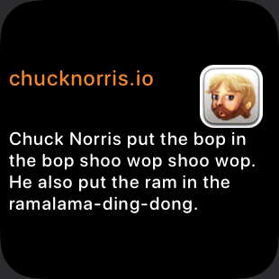
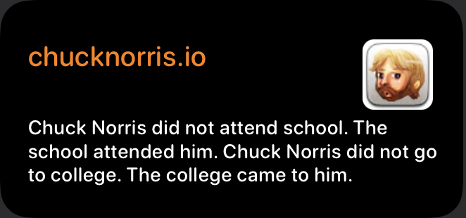

# chucknorris.io
chucknorris.io is a free JSON API for hand curated Chuck Norris facts. 

https://api.chucknorris.io

Setup
- (if not done yet) Download the scriptable app form AppStore
- In Scriptable create a new script
- Copy the code from script chucknorris_scriptable.js
- Create a new widget on homescreen and select this script in scriptable

Usage

Change display size by comment out two of the following lines:
config.widgetFamily : 'small')
// config.widgetFamily : 'large')
// config.widgetFamily : '')

Links
- Chucknorris Free API : https://api.chucknorris.io
   
Contribution
- If you have any ideas for extensions or changes please let me know.

To do
- Move "change display size" to parameters for easy change 
